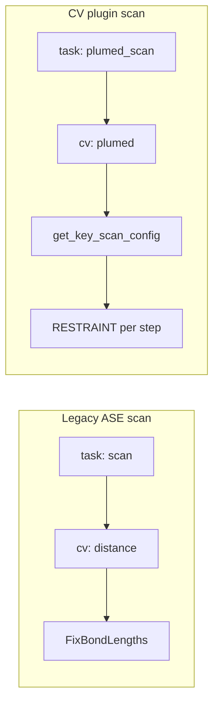

# PLUMED collective-variable plugins

Enerzymette defines **reaction-coordinate (CV) plugins** that build PLUMED input lines. Launchers pass the plugin module to Enerzyme via `enerzyme simulate -pp <path>`. Enerzyme loads that module and calls a named generator function to write `plumed.dat` (see `_get_plumed_config` in Enerzyme’s `simulator.py`).

System-agnostic scheduling (steered MD / per-step scan restraints) lives in `_engine.py`. Each plugin module supplies chemistry-specific CV definitions and bounds.

## Built-in registry

Plugin keys are registered in `PLUMED_CV_PLUGINS` (`__init__.py`). CLI flags `-pp` / `--plumed_patch` take a **key** (e.g. `sammt`), not a file path; launchers resolve the key to the module path with `get_plumed_patch(key)`.

| Key | Module | Description |
|-----|--------|-------------|
| `sammt` | `sammt.py` | SAM methyltransferase coordinate `dd = d1 − d0` |

List keys at runtime: `from enerzymette.plumed_config_generator import list_plumed_cv_plugin_keys`.

To add a plugin in another package, implement the contract below and call `register_plumed_cv_plugin("mykey", "my_package.plumed_mykey")` before launching.

## Plugin contract

For plugin key `<key>`, the module must expose three callables (names are fixed):

| Function | Role |
|----------|------|
| `get_<key>_reaction_coordinate(system, idx_start_from, **params) -> ReactionCoordinate` | Define CV preamble, bounds, and current value on `system`. |
| `get_<key>_config(system, integrate_config, idx_start_from, **params) -> List[str]` | Steered MD: full PLUMED lines (`MOVINGRESTRAINT` schedule). Typically `generate_steered_md(rc, integrate_config)`. |
| `get_<key>_scan_config(system, integrate_config, idx_start_from, target_value, **params) -> List[str]` | One scan point: `RESTRAINT` at `target_value`. Typically `generate_scan_restraint(rc, target_value)`. |

`ReactionCoordinate` fields (`_engine.py`):

- `preamble`: PLUMED lines before restraints (`UNITS`, `DISTANCE`, `COMBINE`, walls, …)
- `cv_name`: restraint argument (e.g. `dd`)
- `lower_bound`, `upper_bound`, `initial_value`: CV range and value on the input structure (Å or plugin units)
- `dump_interval`: `PRINT` / `FLUSH` stride
- `kappa` (optional): restraint force constant (default ≈ 1000 kcal/mol)
- `print_args` (optional): `PRINT ARG=…` list; steered MD uses `mr.*`, scan substitutes `r.*`

Enerzyme merges `sampling.params.plumed_config` into the generator kwargs. For scan steps it also passes `target_value` when regenerating `plumed.dat` each point.

Reference implementation: `sammt.py`.

## Enerzyme YAML schema

### Steered MD (active learning, biased dynamics)

Unchanged from legacy SAMMT workflows:

```yaml
Simulation:
  task: plumed
  idx_start_from: 1
  plumed_config_generator:
    name: get_sammt_config          # get_<key>_config
  integrate:
    integrator: Langevin
    n_step: 100000
    # ...
  sampling:
    params:
      plumed_config:                # forwarded to the generator (**kwargs)
        dump_interval: 20
        lower_bound: -1.5
        upper_bound: 1.5
        reference_pdb_file: ref.pdb
        substrate: ASP
        nucleophile: OD2
System:
  structure_file: initial.xyz
```

Run with the plugin on `PYTHONPATH`:

```bash
enerzyme simulate -c config.yaml -o out/ -m model_dir/ -pp /path/to/sammt.py
```

Enerzymette AL passes `-pp` automatically from `get_plumed_patch(sammt)`.

### PLUMED flexible scan (`plumed_scan`)

CV-plugin scans use **`task: plumed_scan`** and **`sampling.cv: plumed`** (not ASE `FixBondLengths` / `cv: distance`).

```yaml
Simulation:
  task: plumed_scan
  idx_start_from: 1
  optimize:
    optimizer: LBFGS
  plumed_config_generator:
    name: get_sammt_scan_config     # get_<key>_scan_config
  sampling:
    cv: plumed
    params:
      x0: 0.42                      # scan start (often RC value on reactant)
      x1: -1.2                      # scan end
      num: 25                       # number of restrained optimisations
      plumed_config:                # same dict as steered MD (bounds, indices, …)
        dump_interval: 20
        lower_bound: -1.5
        upper_bound: 1.5
        # ...
System:
  structure_file: reactant.xyz
```

Per step, Enerzyme calls `get_<key>_scan_config(..., target_value=x)` with `x` linearly spaced from `x0` to `x1`. Output trajectory: `scan_optim.xyz` (same as legacy `task: scan`).

**Legacy bond scan** (TeraChem / ASE): `task: scan`, `sampling.cv: distance`, `params.i0` / `i1` — unchanged; no `-pp`.

### Endpoint selection (launchers)

`resolve_scan_endpoints` in `__init__.py` sets `x0` from the reactant structure’s `initial_value` and `x1` from, in order:

1. explicit `target_value` (product CV value), or
2. CV value on a product structure (`target_structure_path`), or
3. whichever bound (`lower_bound` / `upper_bound`) is farther from `x0`.

Scantoolkit and altoolkit write the resulting `x0`, `x1`, `num` into the YAML above.

## Enerzymette CLI

### Scan launcher (`enerzymette launch_enerzyme_scan`)

| Flag | Meaning |
|------|---------|
| `-pp` / `--plumed_patch` | CV plugin key (e.g. `sammt`). Enables `plumed_scan` instead of ASE bond scan. |
| `-psc` / `--plumed_cv_config` | YAML file of `plumed_config` kwargs (bounds, PDB reference, atom indices). Required when `-pp` is set. |

With `-pp`, each elementary reaction emits `task: plumed_scan` and passes `-pp` to `enerzyme simulate`.

### Active learning (`enerzymette enerzyme_active_learning`)

| Flag | Meaning |
|------|---------|
| `-pp` / `--plumed_patch` | CV plugin key (required for PLUMED steered MD). |
| `--initial-scan` | Before iteration 0, run the iterative flexible scan (same CV plugin and bounds as steered MD) from the initial structure. |
| `-nis` / `--n_initial_scan_steps` | Scan points per elementary reaction in the initial scan (default `25`). |

**Initial scan workflow** (`--initial-scan`):

1. Under `<output>/initial_scan/`, run chained `plumed_scan` jobs (mirrors scantoolkit).
2. Collect frames from `local_minima/` into a **structure pool** (`structure_pool/state.json`).
3. Each AL iteration rotates through pool entries: first use copies the frame as `initial_structure.xyz`; on reuse, optional presimulation MD (`-np`) updates the pool entry from the last frame.

**Without `--initial-scan`:** pool is a single copy of the initial structure. With `n_presimulation_steps_per_iteration > 0`, presimulation chaining matches the previous AL behavior; with `n_presimulation == 0`, the last steered-MD frame is reused as today.

Steered MD configs still come from your `-sc` simulation YAML (`task: plumed`, `get_<key>_config`). Initial scan configs are generated by altoolkit using `get_<key>_scan_config`.

## Dual scan paths (summary)



## Adding a new plugin

1. Add `enerzymette/plumed_config_generator/mykey.py` implementing the three `get_mykey_*` functions.
2. Register in `PLUMED_CV_PLUGINS` or via `register_plumed_cv_plugin("mykey", ".mykey")`.
3. Point `-psc` / simulation `plumed_config` at the same parameter schema your `get_mykey_reaction_coordinate` expects.
4. Golden-test steered output against a known `plumed.dat` if changing an existing coordinate.

## Debugging

Installed packages may be non-editable. Prepend source trees to `PYTHONPATH`:

```bash
export PYTHONPATH=/path/to/Enerzymette:/path/to/Enerzyme:$PYTHONPATH
```
